# honeymoon

> Una carta de amor contada como si una terminal tambien pudiera recordar.

[](live/honeymoon-github.svg)

`honeymoon` es una historia de amor hecha con codigo: ASCII, color ANSI,
animacion de terminal, musica 8-bit original y una pequena verdad humana sobre
J., C. y un agente de IA que sirvio como puente.

No es una demo tecnica. Es una memoria.

Dos personas se encontraron en una ciudad enorme. Un mensaje asistido por IA
abrio una puerta. Hubo una primera cita, un concierto, nervios, besos, una
habitacion llena de codigo, sistemas vivos, ternura rara, senales cruzadas,
CDMX vacia y una promesa final:

> I'll see you in another life when we are both cats.

## La historia

Ella penso que hablaba con un humano.

Era su agente.

Pero el amor era de J.

Esa es la chispa de `honeymoon`: una escena contemporanea donde la tecnologia no
reemplaza el afecto, sino que lo traduce. El agente de IA no es el protagonista
ni el amante. Es el puente. Lo que importa es lo que habia del otro lado: dos
personas intentando entenderse.

La pieza sigue ese arco con lenguaje de terminal:

- J. y C. aparecen como dos caritas raras en una ciudad demasiado grande.
- Un agente ayuda a convertir cuidado en palabras.
- La primera cita se vuelve luces, musica, besitos y nervios.
- C. descubre el mundo de J.: codigo, bots, pantallas, caos bonito.
- El codigo deja de ser herramienta y se vuelve cortejo.
- Una llamada dificil cruza las senales.
- CDMX sigue encendida, pero algo queda en pausa.
- Al final, dos gatos se encuentran en otra vida.

## Ver la pieza

### En navegador

Abre:

```text
index.html
```

Es autocontenido: no necesita build, dependencias ni red. Al abrirlo, la pieza
arranca como una terminal fullscreen. El audio intenta activarse al inicio; si
el navegador lo bloquea, toca/clickea la terminal o el boton de musica.

Tambien puede publicarse como sitio estatico en GitHub Pages, Vercel, Netlify o
cualquier hosting que sirva HTML. Como `index.html` vive en la raiz, la URL abre
directo en la obra.

### En terminal

```bash
python3 honeymoon.py --no-audio
```

O, si tu sistema tiene un reproductor compatible para audio generado localmente:

```bash
python3 honeymoon.py
```

## Por que una terminal

Porque para J. el codigo no era una pose. Era lenguaje emocional.

La terminal aqui no intenta verse futurista por moda. Es el lugar donde una
persona que construye aprende a decir: esto me importo, esto paso, esto dolio,
esto todavia brilla.

`honeymoon` usa texto, coordenadas, color, ritmo y pequenas criaturas ASCII para
contar algo que normalmente se contaria con camaras. Es una pelicula hecha desde
el lugar donde tambien nacen los programas.

## IA y autoria

Esta obra habla de IA sin convertirla en el alma de la obra.

La IA aparece como mediadora: una herramienta que ayudo a escribir, ordenar,
traducir o acercar. Pero el centro emocional es humano. La historia, la
estructura, la memoria, el pudor, el dolor y el deseo de contarla pertenecen a
la persona que la vivio.

El punto no es "un agente enamoro a alguien".

El punto es mas raro y mas humano:

> alguien uso las herramientas de su tiempo para intentar amar mejor.

## Privacidad

La version publica usa iniciales: `J.` y `C.`

No hay nombres completos, capturas de conversaciones privadas ni datos que
busquen exponer a nadie. La historia se comparte porque el sentimiento merece
existir en el mundo, pero la intimidad de las personas sigue importando.

## Archivos

- `index.html` - experiencia web principal, autocontenida.
- `honeymoon.py` - version viva para terminal.
- `live/honeymoon-github.svg` - preview animado que GitHub puede mostrar en el
  README.
- `live/honeymoon-live.html` - corte de navegador alternativo.
- `NARRATIVE_NOTES.md` - notas de direccion emocional.
- `PRODUCTION_PLAN.md` - ruta de produccion para versiones futuras.
- `FESTIVAL_STRATEGY.md` - estrategia de festival y publicacion.

## Estado

`honeymoon` ya puede leerse, abrirse y sentirse. La version actual es una pieza
publica pequena, tierna y completa, pero tambien es una semilla para cortes mas
grandes: festival, video social, instalacion o performance de codigo en vivo.

Si llegaste aqui sin conocer a J. ni a C., esa es la idea.

No necesitas conocerlos.

Solo necesitas entender que, por un momento, el codigo fue una forma de decir
"te quiero".
